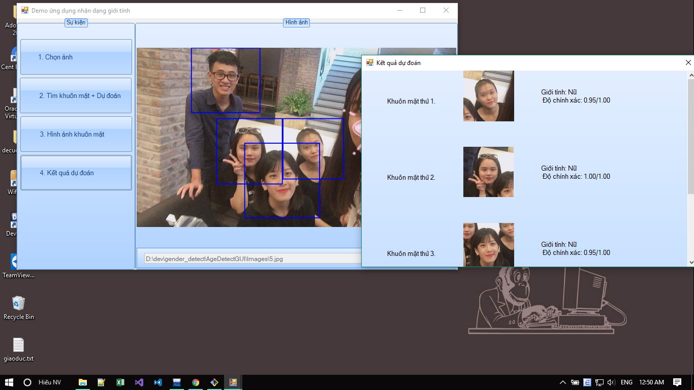

# Gender Detecter

### Requiers:

- Python

- tensorflow

- OpenCV

- Numpy

### Pre-trained Checkpoints

You can find a pre-trained age checkpoint for inception here:

https://drive.google.com/drive/folders/0B8N1oYmGLVGWbDZ4Y21GLWxtV1E

A pre-trained gender checkpoint for inception is available here:

https://drive.google.com/drive/folders/0B8N1oYmGLVGWemZQd3JMOEZvdGs

### Run
```

Example:

python guess.py --class_type gender --model_type inception --model_dir ..\Inception --filename img.jpg --face_detection_model haarcascade_frontalface_default.xml

Result:

Executing on /cpu:0
selected (fine-tuning) inception model
..\Inception\checkpoint-14999
['..\\Result/frontal-face-1.jpg']
Running file ..\Result/frontal-face-1.jpg
Running multi-cropped image
Guess @ 1 M, prob = 0.92
```

### Screenshots


